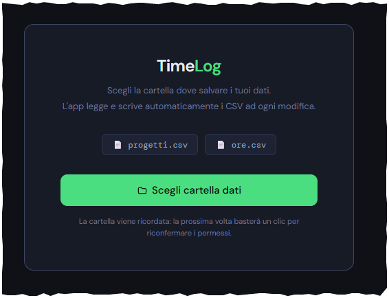

# TimeLog

Applicazione web standalone per registrare ore lavorate per progetto, con persistenza locale su file CSV.

L'interfaccia è contenuta in un solo file, [timetracker.html](/home/pigreco/git/registro_ore_pk/timetracker.html), e usa il File System Access API del browser per leggere e scrivere automaticamente i dati nella cartella scelta dall'utente.

## Funzionalità

- Dashboard con riepilogo mensile delle ore, grafici per progetto e per giorno
- Inserimento di una o più sessioni di lavoro per giornata (ora inizio precompilata con l'ora corrente)
- Modifica di inserimenti esistenti: progetto, data, sessioni e note
- Storico con filtri per mese, team e progetto
- Report mensile per progetto con riepilogo copiabile in Excel
- Gestione anagrafica progetti con nome, team e colore (rinomina e cancellazione)
- Salvataggio automatico su CSV ad ogni modifica

## Requisiti

- Browser moderno con supporto al File System Access API
- Consigliato: Google Chrome, Microsoft Edge o altro browser Chromium aggiornato

## Avvio

1. Apri [timetracker.html](/home/pigreco/git/registro_ore_pk/timetracker.html) nel browser.
2. Al primo avvio scegli la cartella dove salvare i dati.
3. L'app creerà o aggiornerà automaticamente questi file:
   - progetti.csv
   - ore.csv

Non è richiesto alcun backend.



## File dati

### progetti.csv

Intestazione:

```csv
id,nome,colore,team
```

### ore.csv

Intestazione:

```csv
entry_id,sessione_id,progetto_id,data,ora_inizio,ora_fine,ore,desc_sessione,note_giornata,timestamp
```

## Note tecniche

- I dati vengono mantenuti nella cartella selezionata dall'utente, non in un database remoto.
- La cartella scelta viene ricordata localmente nel browser tramite IndexedDB.
- I grafici sono renderizzati con Chart.js caricato da CDN.

## Struttura del progetto

- [timetracker.html](/home/pigreco/git/registro_ore_pk/timetracker.html): applicazione completa, UI, logica e persistenza CSV